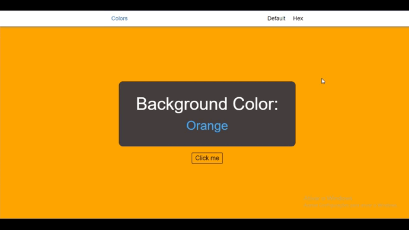
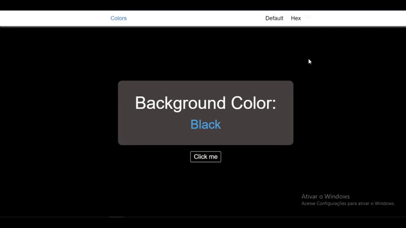

# Changing-Colors

## | About

This is a basic project that basically generates random colors and its values.

## | Overview
### | Default Colors

Here It's displaying limited colors in an array.

### | Hex Colors

Here It's displaying random colors.

## | Made Using
<ul>
<li>HTML</li>
<li>CSS</li>
<li>Javascript</li>
</ul>

## | How to Run
Make sure "Git" is installed in your PC!

    git clone https://github.com/Bruno-Messias-B-S/Changing-Colors.git

## Made By
[Bruno Messias](https://www.linkedin.com/in/bruno-messias-bs/)